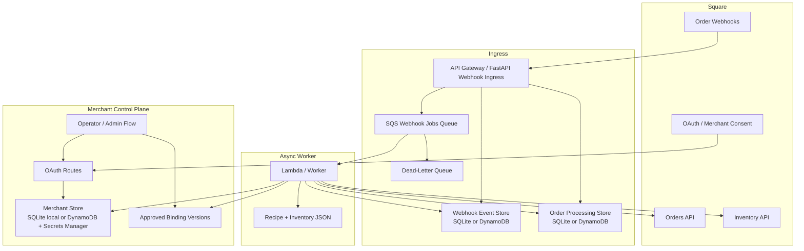

# Mosa Tea Inventory Automation

Turns completed Square drink orders into raw ingredient and packaging depletion.

This project exists because POS sales are not the same thing as inventory consumption. A single drink sale can imply tea leaves, milk, sugar-level rules, toppings, foam, cups, lids, and straws. This service maps that gap and writes the resulting inventory adjustments back to Square.

## Architecture



### Runtime Flow

```mermaid
flowchart LR
    A[Square order.completed webhook]
    B[Verify signature and record event]
    C[Reserve / mark order pending]
    D[Enqueue SQS job]
    E[Worker fetches full order]
    F[Resolve merchant token + approved binding]
    G[Project ingredient and packaging usage]
    H[Write inventory adjustments to Square]
    I[Mark order applied]

    A --> B --> C --> D --> E --> F --> G --> H --> I
```


## Current Shape

- Config-driven recipe and inventory modeling in JSON
- Idempotent order processing with persisted state
- Webhook event ledger for duplicate/retry control
- OAuth merchant onboarding with token refresh and revoke handling
- Merchant-aware runtime with approved binding and write-enable gates
- Local mode with SQLite
- AWS-backed mode with SQS, Lambda, DynamoDB, Secrets Manager, and DLQ
- GitHub Actions CI plus manual Lambda deploy workflow

## Stack

- Python
- FastAPI
- Square Orders / Inventory APIs
- SQS
- Lambda
- DynamoDB
- SQLite
- `unittest`

## Run Locally

Create `.env` from `.env.example` and set:

- `SQUARE_ACCESS_TOKEN`
- `SQUARE_ENVIRONMENT`
- `SQUARE_WEBHOOK_SIGNATURE_KEY`
- `SQUARE_WEBHOOK_NOTIFICATION_URL`

Optional runtime mode config:

- `WEBHOOK_DISPATCH_MODE=local|sqs`
- `ORDER_PROCESSING_STORE_MODE=sqlite|dynamodb`
- `WEBHOOK_EVENT_STORE_MODE=sqlite|dynamodb`
- `AWS_REGION`
- `WEBHOOK_JOB_QUEUE_URL`
- `DYNAMODB_ORDER_PROCESSING_TABLE`
- `DYNAMODB_WEBHOOK_EVENT_TABLE`

Start the server:

```bash
uvicorn server:app --reload --port 8000
```

Admin console:

```text
http://127.0.0.1:8000/admin/order-processing
```

## Useful Commands

```bash
./.venv/bin/python -m unittest discover -s testing -p 'test_*.py'
./.venv/bin/python -m scripts.search_orders
./.venv/bin/python -m scripts.inspect_order ORDER_ID
./.venv/bin/python -m scripts.process_sqs_webhook_job
./.venv/bin/python -m scripts.replay_order ORDER_ID
./.venv/bin/python -m testing.create_live_test_order --pay roasted_buckwheat_barley_milk_tea_100_sugar
```

## Key Files

- `server.py`: Square webhook entrypoint
- `app/order_processor.py`: shared processing pipeline
- `app/webhook_worker.py`: queue job execution
- `app/lambda_sqs_worker.py`: Lambda handler
- `app/order_inventory_projection.py`: recipe resolution and usage projection
- `app/order_processing_store.py`: order-processing state abstraction
- `app/webhook_event_store.py`: webhook event state abstraction
- `data/recipe_map.json`: drink recipes and rules
- `data/inventory_item_map.json`: inventory item mappings

## Docs

- [Docs index](docs/README.md)
- [API Gateway serverless ingress](docs/api-gateway-serverless-ingress.md)
- [AWS cost analysis](docs/aws-cost-analysis.md)
- [SQS dead-letter queue behavior](docs/sqs-dlq-behavior.md)

## Status

This is no longer just a local script project. It now has a production-shaped event pipeline, live AWS integration, CI, deploy workflow, DLQ handling, and real end-to-end sandbox validation.
